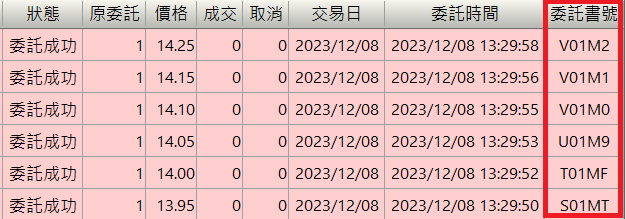

    {:title "使用 frozenset 處理委託書號與序號對應問題" :layout :post :tags ["python" "trading" "exchange"] :toc false}

# 　

## 委託書號與序號

只要交易委託有送到交易所，你就會收到委託書編號 (Book Number, bookNo)，簡稱 **委託書號**

在台灣委託書號原則上都是 5 碼英數字混合，不分大小寫 <a id="fnr.1" class="footref" href="#fn.1" role="doc-backlink">1</a>

而預約單或智慧單<a id="fnr.2" class="footref" href="#fn.2" role="doc-backlink">2</a>，可能還未送到交易所，但券商已經收到

就會自己編委託書序號（Sequence number, seqNo)，簡稱 **委託序號**

每家券商編法不同，一種方式是編 13 碼純數字

所以一個委託，他就可能存在多個可以當作委託索引 (index) 的東西：

1.  在還沒有抵達交易所前，在券商那預約中，僅有委託序號
2.  交易所開始接收券商委託，會有委託序號和委託書號

對於這種多重且不定的鍵值的情況，可以使用 Python `frozenset` 當字典的 key

 

## `frozenset` 的用法

先來複習一下 `frozenset` 有兩個主要功能：

1.  不可更改且不會重複的集合
2.  可做為字典的 key

第一點衍生的使用情境就是，在跨進程間共享不可重複變數。

第二點的使用情境比較多，基本上可以分成兩類：

a. 時間面, 紀錄資料的版本或更新

b. 空間面, 表示資料的複數特徵

例如你原本有一個基本資料表單，並且紀錄每個版本使用者完成並審核通過的欄位

透過 `frozenset` 可以有另一種寫法：

    data = [{ version: 1, verified: set(["name"]) },                # 新增名字, 驗證通過
            { version: 2, verified: set(["name" "phonenumber"]) },  # 新增手機號碼, 驗證通過
            { version: 3, verified: set(["name" "address"])},       # 修改手機號碼, 沒有驗證 ; 新增地址, 驗證通過
    
    # frozenset
    data = {
        frozenset(["name"]): {version: 1},
        frozenset(["name", "phonenumber"]): {version: 2},
        frozenset(["name", "address"]): {version: 3}
    }

使用 `frozenset` 作為字典 key，通常代表狀態比較確定，或是有固定有限的複數特徵

並且作為複雜的 key, 通常對應的東西應該要簡單單一，否則複雜對應複雜，就失去意義

 

## 委託書號與序號對應問題

所以我們就能使用 `frozenset` 作為字典 key, 例如：

    replyDict = {
        frozenset(["V01M0", "12345678"]): reply1,
        frozenset(["23456789"]): reply2
    }
    
    # 查找非常簡單:
    seqNo = "23456789"
    for key, value in replyDict.items():
      if seqNo in key:
          reply = value
          break

查找就變得非常簡單，委託書號和序號都會找到同一個 Reply

而如果一旦送到交易所有委託序號了，就能：

    # 得到委託書號了，新增 key 也非常方便
    seqNo = "23456789"
    bookNo = "ABC12"
    for key, value in replyDict.items():
      if seqNo in key:
          replyDict[frozenset(key | {bookNo})] = value
          del replyDict[key]
          break

就算在多線程, 多進程中, 用原始 `seqNo` 找也會找到對的, 所以不用擔心

透過這個方式，就可以無論委託書號或序號，都能指向同一個資料，就不需要判斷了

甚至改單、刪單要互相指向同一個 Order，也都可以很容易做

# Footnotes

<a id="fn.1" href="#fnr.1">1</a> 委託書編號原則 (公文) <https://www.tpex.org.tw/storage/eb_data/9905/0500057.htm>

<a id="fn.2" href="#fnr.2">2</a> 在台灣洗價、觸價單、多重IOC單是券商服務，概括是智慧單
