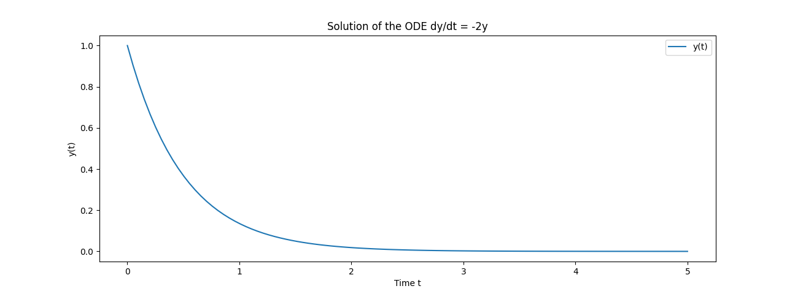
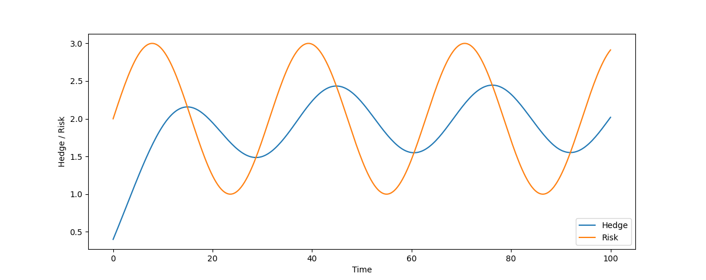

    {:title "使用 SciPy 的 solve_ivp 建立投資組合調倉策略" :layout :post :tags ["python", "trading", "ode", "risk", "modeling"] :toc false}

# 　

## 避險 = 對時間的微分方程

如果我們假設市場存在一個風險特徵 `V(t)` ，而我們避險策略是 `E(t)`

當避險目標和風險特徵吻合， `V(t_k) = E(t_k)` ，我們在 `t=t_k` 時點的投資組合不需要調整

如果當風險特徵大於避險策略 `V(t_k) > E(t_k)` ，需要提高我們的避險幅度 `E(t_k+1) > E(t_k)`

當風險特徵小於避險策略 `V(t_k) < E(t_k)` ，需要降低我們的避險幅度 `E(t_k+1) < E(t_k)`

這樣的概念，就能轉化成一個 ODE： `dE(t)/dt = f(t) * ( V(t) - E(t) )`

其中的 `f(t)` 就是應對這個風險特徵與避險目標落差幅度所需的操作

我們就能把任何避險調倉操作，轉換成一個 ODE 問題來求解

 

## SciPy 的 `solve_ivp`

`solve_ivp` 是 SciPy 的一個函數，可以基於給定的初始值對 ODE 求解

也就是將 ODE 看成是一個初始值問題<a id="fnr.1" class="footref" href="#fn.1" role="doc-backlink">1</a>
(Initial Value Problem, IVP) 進行求解 (Solve)

我們可以對 `solve_ivp` 指定求解的精度，透過使用 `numpy` 指定涉及變量的網格採樣點

並且也能針對給定位置檢測零值、極值發生的事件，一個簡單的初始值問題如下：

    from scipy.integrate import solve_ivp
    import numpy as np
    import matplotlib.pyplot as plt
    
    # 定義一個 ODE: dy/dt = -2y, 其中初始值條件為 y(0) = 1
    y0 = [1]
    def odefn(t, y):
        return -2 * y
    
    # 定義時間的採樣點範圍，並在該範圍採樣
    t_span = (0, 5)
    t_eval = np.linspace(0, 5, 100)
    sol = solve_ivp(odefn, t_span, y0, t_eval=t_eval)
    
    # 各時間點的對應的解
    print(sol.t)
    print(sol.y)
    
    # 繪圖
    plt.plot(sol.t, sol.y[0, :], label='y(t)')
    plt.xlabel('Time t')
    plt.ylabel('y(t)')
    plt.title('Solution of the ODE dy/dt = -2y')
    plt.legend()
    plt.show()

 

## 求解調倉策略

如果考慮調倉操作為一個固定速度 `k` ，風險與避險目標差距越大，就要越積極做避險：

`dE(t)/dt = k * ( V(t) - E(t) ), k > 0`

接著我們就能對風險建模，常用的方法可能是均值回歸的時間序列模型

在此我們以 `sin` 來示範：

    import numpy as np
    from scipy.integrate import solve_ivp
    import matplotlib.pyplot as plt
    
    def PortfolioDynamics(t, E, k, V_func):
        return k * (V_func(t) - E)
    
    def Risk(t):
        # 這裡假設風險變化是時間的正弦函數
        return 2 + np.sin(t / 5)
    
    # 初始值
    k = 0.1
    E0 = [0.4]
    
    # 求解 ODE
    t_span = (0, 100)  # 給定時間範圍
    t_eval = np.linspace(t_span[0], t_span[1], 300)
    sol = solve_ivp(PortfolioDynamics, t_span, E0, args=(k, Risk), t_eval=t_eval)
    
    # 繪圖
    plt.plot(sol.t, sol.y[0], label='Hedge')
    plt.plot(sol.t, [Risk(t) for t in sol.t], label='Risk')
    plt.xlabel('Time')
    plt.ylabel('Hedge / Risk')
    plt.legend()
    plt.show()

從這張圖可以看到：

1.  初始值對初始值問題 IVP 的影響，起始避險目標不足，就得花更大的功夫追上風險特徵
2.  由於調倉是基於風險與避險目標的差值做決策，始終落後於風險變化，有週期錯位的感覺

 

## 反之亦然：從風險和交易結果，反過來對行為建模

這個 ODE 求解本身並沒有太多厲害之處，但是如果你現在有兩條線，就能反推你的交易行為建模

將你的交易行為還原成一種 ODE，可能不只一階，有二階、三階甚至高階

最常見的就是市場波動度，與你的交易策略在不同波動度底下的交易行為，反過來建模

建模起來就能推測你後續的交易行為，這也可以作為一種對交易結果逆向工程破解交易策略的方法

再一個反之，如果破解不了，就代表沒有蘊含清晰的時變動力系統 (Time-varying dynamics)

可能是基於事件、其他因素做交易，而非簡易的計算邏輯，可能很多交易來自特殊決策

 

# Footnotes

<a id="fn.1" href="#fnr.1">1</a> 初始值問題是微分方程的一種問題，請見: <https://zh.wikipedia.org/zh-tw/%E5%88%9D%E5%80%BC%E5%95%8F%E9%A1%8C>
