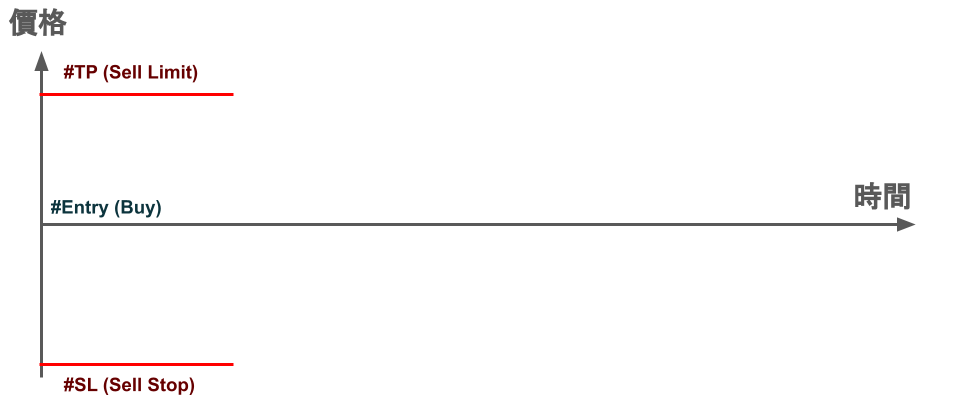
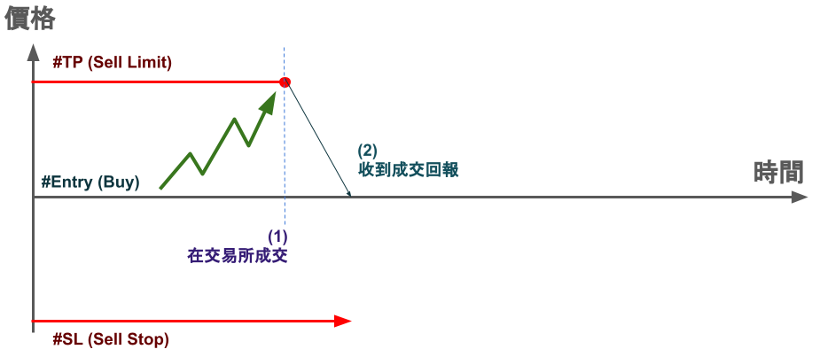
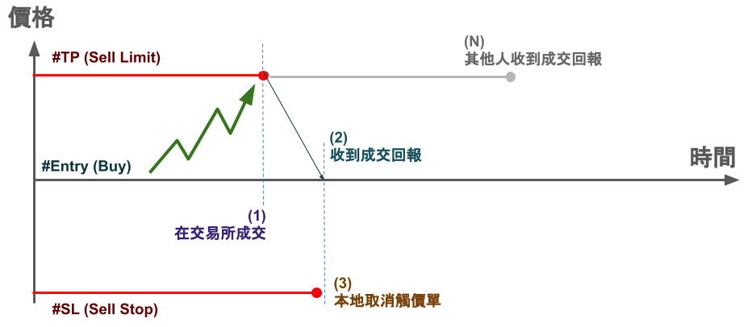
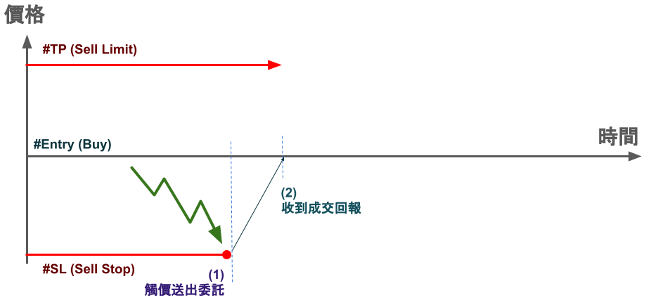
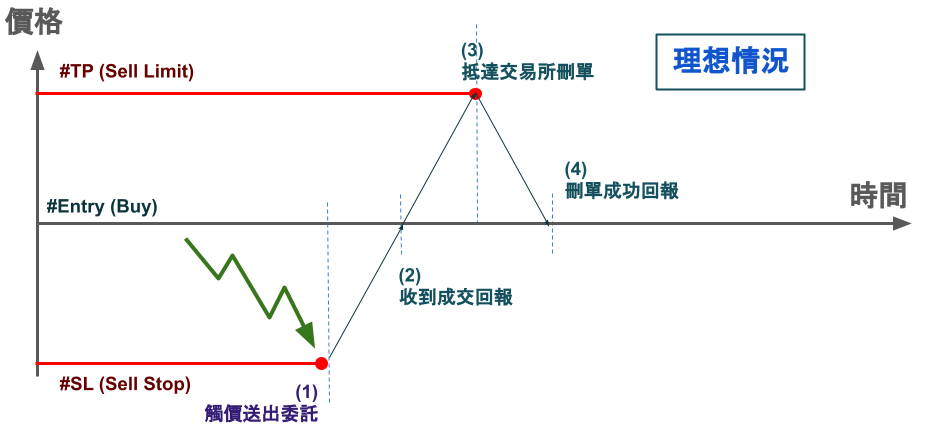
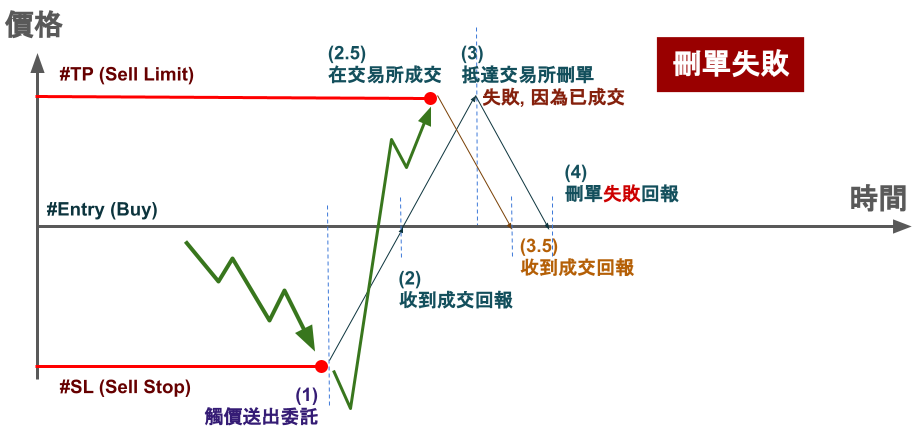

    {:title "證券停損與停利操作，沒有你想的那麼簡單" :layout :post :tags ["trading" "order"] :toc false}

# 　

## 停損停利：證券與期貨的差異

在期貨市場中，券商通常會允許你掛單的同時，可以設定停損與停利價位

因為你有放保證金，所以無論是往停損與停利方向如何移動

券商大抵上都能幫你執行觸價單，不用擔心你是否有庫存、額度的問題

 

然而在證券市場中，你如果買進一張台積電，想要設定停損與停利

通常你只能在停損與停利其中一邊掛賣單，因為你只有庫存一張

而另一邊你得自己在客戶端跑洗價，或是借券、無券空，多空一張

事情就沒那麼容易了

 

## 情況 I：停利送出委託，停損本地洗價

若暫時不考慮有庫存或額度上的操作，我們可以看下圖：

假設我們買進了一張台積電，一個合理的做法是對能限價的那一邊

掛出委託，也就是停利價位掛出一張 Sell Limit，庫存就用完了

然後在停損這一邊，本地洗價 Sell Stop

只要 #SL 和 #TP 有一邊成交，我們就把另一邊取消，類似二擇一操作

只是在這個情況中，我們 #TP 的委託是已經送到交易所

我們現在考慮價格碰到 #TP 價位並且成交 `(1)` ，你會收到成交回報 `(2)`

這時候你就需要停止 #SL 的本地洗價並取消 `(3)`

並且由於成交回報會領先其他人收到成交通知 `(4)` ，順序就會像：

接著我們可以考慮價格是先觸碰到 #SL，由於本地在洗價 `(1)` 被觸發

就會送 #SL 到交易所，然後在 `(2)` 收到回報：

這時候你想要把 #TP 刪單，但問題會比想像中複雜

我們先考慮理想情況，你送出刪單請求到交易所 `(3)`

接著收到交易所刪單成功的回報 `(4)` ，多數情況是這樣沒錯：

然而你可能遇到刪單失敗的情況，假如價格突然拉回

你的 #TP 由於在交易所，所以可能會在 `(2)` ~ `(3)` 中間的時候

被觸發成交 `(2.5)` ，並且在你刪單送出到拿刪單結果的中間 `(3)` ~ `(4)`

你會先收到成交通知 `(3.5)` ，然後再收到刪單失敗的通知 `(4)`

像這樣買一張，卻賣到兩張的情況，要怎麼解決呢？

我們會在第二篇來討論，兩邊都放本地洗價的方式，並且這也是 OCO 二擇一單的基本原理

 

