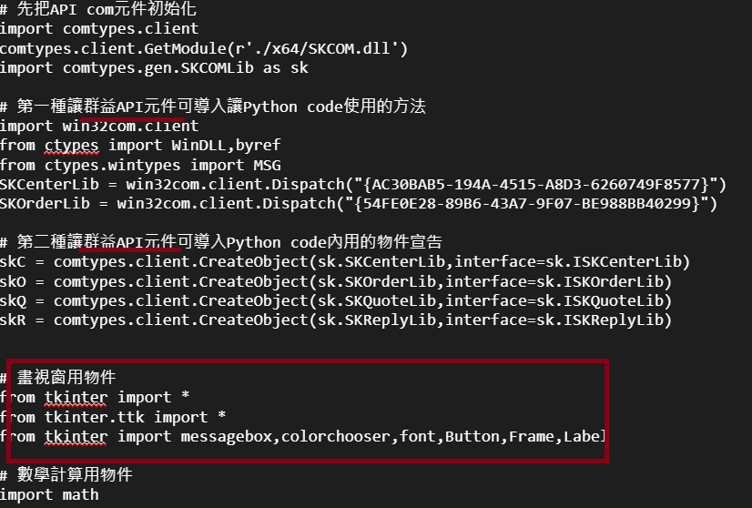
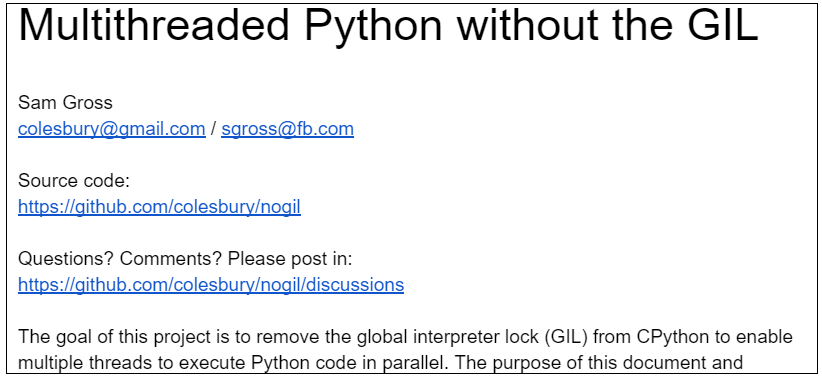

    {:title "券商交易軟體開發如何應對 3.13 移除 GIL 的未來 — 以 Tkinter 為例" :layout :post :tags ["python", "cpython", "gil", "trading"] :toc false}

# 　

 當在使用 Python 開發交易軟體時，你會在兩個方面發生並行<a id="fnr.1" class="footref" href="#fn.1" role="doc-backlink">1</a>：

1.  執行交易相關的運算，並行運算可以更快算完，避免交易決策執行的延遲
2.  交易介面的並行監聽，同時監聽有人點了視窗 A 的 "買進" 與視窗 B 調整買進數量的按鈕

Python 預計 3.13 開始可能會移除 GIL，而這將會對交易軟體的使用行為產生決定性的影響<a id="fnr.2" class="footref" href="#fn.2" role="doc-backlink">2</a>

尤其是許多券商的 API 教學都是以 Tkinter 作為範例

 

## Python 的全局解釋鎖 GIL 與移除的未來

具有全局解釋鎖 (GIL<a id="fnr.3" class="footref" href="#fn.3" role="doc-backlink">3</a>) 的 Python, 確保了同時只會有一個 Python 程式行為

能被Python 理解並具體執行，而這就大大影響了效能

因為並行的事件就得排隊執行，然而移除 GIL 的確就能大幅度提升效能

但是也反過來會有並行處理的風險，如果有人同時點了買進與調整買進數量的按鈕

到底他是要買調整過後數量還是調整前？移除 GIL 的話，Python 可能不再保證誰先誰後

因此無論開發交易軟體的前端介面或後台運算，都需要思考 GIL 可能帶來的影響

 

## 目前移除 GIL 的方向

目前移除 GIL 應該會採用 Sam Gross 的 3.9-nogil<a id="fnr.4" class="footref" href="#fn.4" role="doc-backlink">4</a>
(含意: No GIL) 版本，有幾個重要方向：

1.  偏差計數：單線程的物件的計數，與多線程物件的計數處理方式將會分開

2.  永生化：當物件的計數為零時，物件就被刪除、記憶體就釋放
    一些常用的東西可能永遠不刪除，例如 `True`, `False`, `None`

3.  延遲引用計數：某些東西的引用計數會被推遲，例如 Module 中的頂層函數<a id="fnr.5" class="footref" href="#fn.5" role="doc-backlink">5</a>

4.  Thread-safe 的記憶體分配方式

還有很多其他改進，但以上是較為重要的方向。

總之，越是依賴 GIL 並造成侷限的套件，越有可能因為移除 GIL 而出問題（也可能被解放）。

 

## 以交易軟體開發常用框架 Tkinter 為例

首先最大的挑戰，會在於交易軟體中使用的第三方框架與套件，是否安全的支持 No-GIL

例如 GUI 開發的 Tkinter，就依賴 GIL 完成：

1.  事件處理：滑鼠點擊、鍵盤事件，由於 GIL 保證了處理順序
2.  控件管理：當你要更新標籤、輸入框，一定得回到主線程，本身非線程安全<a id="fnr.6" class="footref" href="#fn.6" role="doc-backlink">6</a>
3.  事件循環：透過單一主線程 `mainloop`<a id="fnr.7" class="footref" href="#fn.7" role="doc-backlink">7</a> 處理所有 GUI 事件

某種程度來說，No-GIL 會釋放 Tkinter 的限制，但是 Tkinter 是否能良好支援？

Tcl/Tk 是有能特別支持不可多線程的版本，因此 Tkinter 會直接從 Python 起始的 thread

調用底層的 library，GIL 會確保只有一次調用。

如果移除了 GIL，那就要使用 Tcl/Tk 可支持多線程的版本，那 Tkinter 就需要做很大的調整

是否要保留 `mainloop` 的設計，並只允許一個 Tk 實例呢？

這些都值得在繼續留意，在此只以這為一個例子。

不過至少券商交易 API 通常都沒有主動建立 Event Loop，No-GIL 絕對是好事

我是沒有用 Tkinter 用別的，但是交易軟體對於操作的精確性是要求很高的，因此前端介面

跨視窗的並發需求要好好處理。

 

## 小結

當然不只有 Tkinter，尤其是交易軟體中使用到的套件，涉及到作業系統底層的交互與運算。

個人陋見來看，整體交易軟體架構的設計與技術選型，從一開始就要特別考慮這些問題

倘若依賴框架，現在就需要特別去關心這樣的問題。

-   

# Footnotes

<a id="fn.1" href="#fnr.1">1</a> 關於並行運算，請見  <https://zh.wikipedia.org/zh-tw/%E5%B9%B6%E5%8F%91%E8%AE%A1%E7%AE%97>

<a id="fn.2" href="#fnr.2">2</a> 移除 GIL 請見 PEP-703  <https://peps.python.org/pep-0703/>

<a id="fn.3" href="#fnr.3">3</a> 關於全局解釋鎖，請見 <https://zh.wikipedia.org/wiki/%E5%85%A8%E5%B1%80%E8%A7%A3%E9%87%8A%E5%99%A8%E9%94%81>

<a id="fn.4" href="#fnr.4">4</a> 3.9-nogil 文件請見 Google Docs  <https://docs.google.com/document/d/18CXhDb1ygxg-YXNBJNzfzZsDFosB5e6BfnXLlejd9l0/edit?_x_tr_hist=true#heading=h.kcngwrty1lv>

<a id="fn.5" href="#fnr.5">5</a> 不是頂層函數的函數就例如: 函數的函數, 類的方法函數 &#x2026; 等

<a id="fn.6" href="#fnr.6">6</a> 見 O'Reilly 的 Tkinter GUI Application Development Blueprints - Second Edition:  <https://www.oreilly.com/library/view/tkinter-gui-application/9781788837460/36084602-c501-4eac-a407-ebc99c510d33.xhtml>

<a id="fn.7" href="#fnr.7">7</a> <https://docs.python.org/zh-tw/3.10/library/tkinter.html#threading-model>
