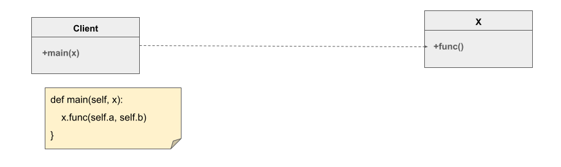
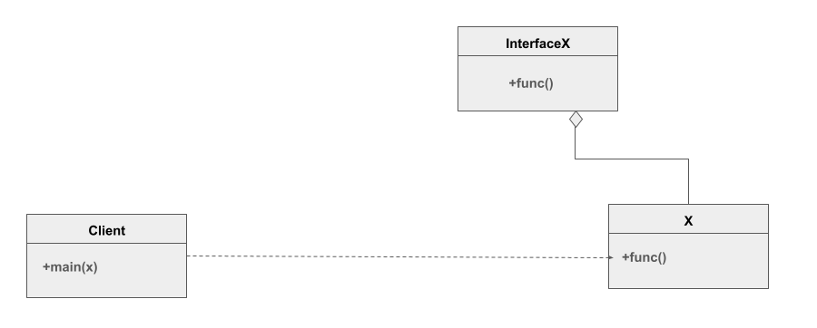
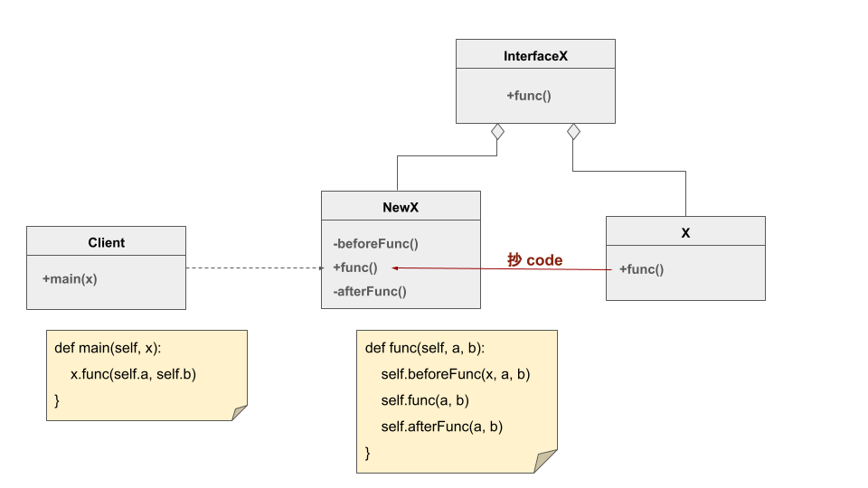
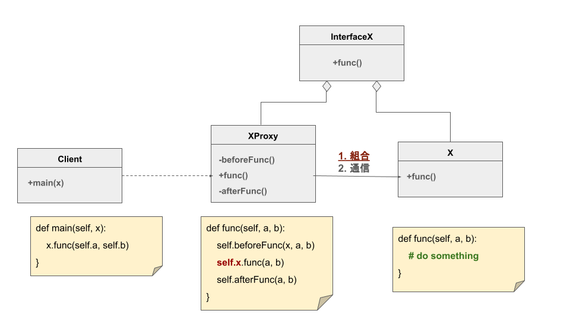
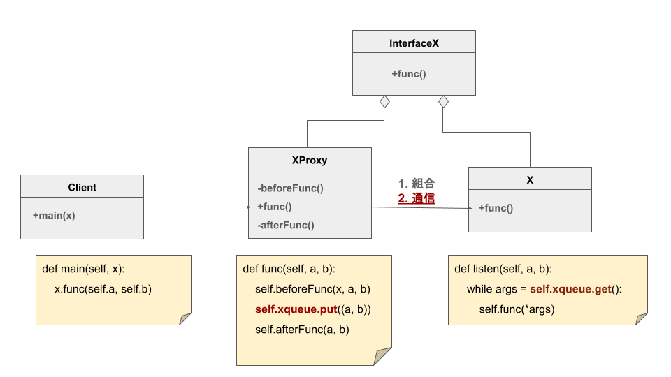

    {:title "交易軟體中的設計模式 (1) 代理模式與 COM 元件" :layout :post :tags ["python" "trading" "architecture" "com"] :toc false}

# 　

 

## 代理模式 Proxy Pattern

我們先走一遍，代理模式的結構是如何產生的

我們現在有一個 `Client` ，而他的 `main()` 會需要使用到 `X` 的 `func()` ：

由於 **設計需求** (後面討論)，我們希望 `Client` 不要直接接觸 `X`

例如， `X` 可能還有很多其他函數： `unsafeFunc1` , `unsafeFunc2` , `unsafeFunc3`

但我們不希望 `Client` 碰到，所以我們先定義一個介面，這個介面只有 `func()` ：

接著我們依照介面實作 `NewX` 作為 `Client` 互動對象，並且只有 `func()` 可用：

你還可以在 `func()` 前後做些準備，讓調用 `func()` 之前與之後做好充足準備

例如透過 `beforeFunc()` 檢查傳入的東西是否合法， `func()` 是否可以執行

或是透過 `afterFunc()` 把結果做些處理，再返回給 `Client`

你也可以把 `X` 的 `func()` code 抄過來，讓 `Client` 與整個 `X` 解耦

 

然而事情可能沒有那麼簡單， `func()` 高度依賴 `X` 內部的屬性與方法

那你就必須讓 `NewX` 持有 (has-a) `X` ，那這就是最經典的 **組合代理模式** ：

這時候 `NewX` 就是 `XProxy` ，並持有 `X` ，透過 `self.x.func()` 調用

 

有時候，你可能無法持有 `X` ，例如 `X` 在另一個進程、在另一個電腦

那你就需要在 `XProxy` 與 `X` 之間建立通信，考慮 **通信代理模式**

這邊先最簡單的多進程共享 Queue 舉例

假設 `X` 在另一個進程中，初始化設置好與 `XProxy` 共享一個 `xqueue` ：

所以你可以在 `XProxy` 中透過往 `xqueue` 放入 args `(a, b)`

並讓 `X` 透過對 `xqueue` 的監聽，取出後執行 `func()` ，達成代理的功能

 

## 交易軟體中的設計需求：COM 元件的生命週期

如果券商提供的 API 是透過 COM 元件連線，有時候連線中斷後，你可能要重新連線

然而 COM 元件內部他怎麼紀錄使用狀態你不知道，就可能造成重新連線並沒有把狀態全部重置

而我們執行的 COM 元件，可能也要重啟 Event loop，然後重新 coInitialize<a id="fnr.1" class="footref" href="#fn.1" role="doc-backlink">1</a>

**由於無法確保獲信賴第三方套件，最安全的做法就法就是讓 COM 元件跑在另一個進程** <a id="fnr.2" class="footref" href="#fn.2" role="doc-backlink">2</a>

如果券商 API 執行在另一個進程，那就像是前面的 `X` 一樣

我們在主進程中，就得透過 `XProxy` 來使用 API，並且可以監控 `X` 的狀況

而在 API 出問題時，可以透過 `XProxy` 直接把進程殺死並重啟，確保環境狀態完整重置

當然，這些都是有附加的代價，設計永遠都是各種權衡

關於代理模式的優缺點網路上有很多文章，大家需要根據自己的需求自己選擇

 

# Footnotes

<a id="fn.1" href="#fnr.1">1</a> 在 Python 中，得透過 `comtypes.CoInitialize` 初始化環境，包含確保線程安全、管理生命週期

<a id="fn.2" href="#fnr.2">2</a> 相比之下，多數 DB 的 Client 端是開源的且封裝良好，需要使用到的設計模式是 repository pattern
