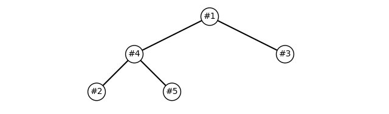

    {:title "透過 heapq 設置下單優先級以便洗價與定時單優先處理" :layout :post :tags ["python" "queue" "trading"] :toc false}

# 　

## 下單優先級的需求

通常在開發一個交易軟體，除了使用者介面操作觸發下單行為之外

可能也會有系統本身排程觸發的下單行為，例如客戶端洗價、客戶端定時單、客戶端預風控等

這些下單可能會存在優先級，例如洗價第一、定時單第二、用戶手動下單第三

當然這個順序也可能根據需求不同，或是有更複雜的優先級評判原則

例如各種不同市場的商品都是使用相同 API，而 API 本身會依序執行

那可能現貨的單必須先送出，其次是期貨的單 &#x2026; 類似這樣的情況

總之，送單優先級的需求一定有，甚至其他各種層面也會有優先級的需求

 

## 使用 `heapq`

Python 的 `heapq` 本身實現了堆隊列的功能，可以讓我們實現優先級隊列：

    import heapq
    
    class PriorityOrderQueue:
        def __init__(self):
            self.orderQueue = []
    
        def push(self, order):
            heapq.heappush(self.orderQueue, (-order[0], order[1:]))
    
        def pop(self):
            if self.orderQueue:
                return heapq.heappop(self.orderQueue)[1]
            raise IndexError("不能對空的優先級隊列做彈出")
    
        def items(self):
            return self.orderQueue
    
        def __bool__(self):
            return bool(self.orderQueue)
    
    pendingOrders = PriorityOrderQueue()

這個優先級下單隊列，需要放入 `(優先級, 流水號, 資料)`

然後在插入 (push) 會轉換成二元組 `(優先級, (流水號, 資料))`

並以優先級的負值作為堆隊列根節點的彈出 (pop) 的參考，越小值越先彈出

除了 `push` , `pop` 之外，還需要 `__bool__` 以便我們阻塞消化， `items` 取得全部是為了畫圖

以下是一個範例：

    pendingOrders = PriorityOrderQueue()
    
    pendingOrders.push((5, 1, "洗價處價單, 買進 10 張, 台積電"))
    pendingOrders.push((1, 2, "手動下單, 賣出 5 張, 長榮"))
    pendingOrders.push((3, 3, "定時單, 買進 20 張, 廣達"))
    
    while pendingOrders:
        print(pendingOrders.pop())
    
    # (1, '洗價觸價單, 買進 10 張, 台積電')
    # (3, '定時單, 買進 20 張, 廣達')
    # (2, '手動下單, 賣出 5 張, 長榮')

## 對 `heapq` 繪圖

我們也可以繪圖來看看我們的堆隊列：

    pendingOrders = PriorityOrderQueue()
    
    # 插入一些交易数据，格式为 (优先级, 交易信息)
    pendingOrders.push((5, 1, "洗價觸價單, 買進 10 張, 台積電"))
    pendingOrders.push((1, 2, "手動下單, 賣出 5 張, 長榮"))
    pendingOrders.push((3, 3, "定時單, 買進 20 張, 廣達"))
    pendingOrders.push((5, 4, "洗價觸價單, 買進 3 張, 群益證"))
    pendingOrders.push((1, 5, "手動下單, 賣出 5 張, 台積電"))
    
    def plotHeap(heap):
        # 計算二項樹深度
        heapSize = len(heap)
        depth = int(np.ceil(np.log2(heapSize + 1)))
    
        # 繪圖設定
        _, ax = plt.subplots()
        ax.set_aspect('equal')
        plt.axis('off')
    
        # 遞迴繪製節點和邊
        def drawNode(nodeIdx, x, y, dx):
            if nodeIdx < heapSize:
                # 繪製節點
                ax.text(x, y, "#"+str(heap[nodeIdx][1][0]), ha='center', va='center',
                        bbox=dict(facecolor='white', edgecolor='black', boxstyle='circle'))
    
                # 左子節點
                leftChildIdx = 2 * nodeIdx + 1
                if leftChildIdx < heapSize:
                    leftX, leftY = x - dx, y - 1
                    ax.plot([x, leftX], [y, leftY], c='black')
                    drawNode(leftChildIdx, leftX, leftY, dx / 2)
    
                # 右子節點
                rightChildIdx = leftChildIdx + 1
                if rightChildIdx < heapSize:
                    rightX, rightY = x + dx, y - 1
                    ax.plot([x, rightX], [y, rightY], c='black')
                    drawNode(rightChildIdx, rightX, rightY, dx / 2)
    
        # 最終從根節點開始繪製
        drawNode(0, 0, 0, 2 ** (depth - 2))
    
        # 調整邊界與顯示
        plt.xlim(-2**(depth-1), 2**(depth-1))
        plt.ylim(-depth, 1)
        plt.show()
    
    plotHeap(pendingOrdersHeap)

依序操作就會從根節點依序往下處理：

    while pendingOrders:
        print(pendingOrders.pop())
    
    # (1, '洗價觸價單, 買進 10 張, 台積電')
    # (4, '洗價觸價單, 買進 3 張, 群益證')
    # (3, '定時單, 買進 20 張, 廣達')
    # (2, '手動下單, 賣出 5 張, 長榮')
    # (5, '手動下單, 賣出 5 張, 台積電')

 

